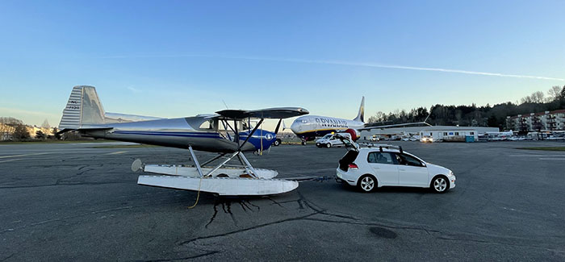

_Denali from FL220_

# About
Hey, I'm Scott. I'm an airline pilot based in Anchorage. I write code for projects involving airplanes, bicycles, and more. I referee cycling and am the volunteer conference director for the Northwest Collegiate Cycling Conference. This is my personal site for projects I'm working on.

* * *

## Projects

_1946 Luscombe 8F seaplane at Renton Municipal Airport - KRNT_

### Luscombe 8
A 1946 Luscombe 8F Seaplane
* EDO 1320 Floats
* Continental O-200

### Collegiate Conference Software
Software to tabulate and manage season points for collegiate cycling events.

* * *

## Experience
### Airline related
> ### A FAR 121 Airline
> **Anchorage, AK** – *March 2022 - Present*  
> Embraer 175 First Officer. Ground school instructor.

> ### A FAR 135 Airline
> **Bethel, AK** – *March 2021 - March 2022*  
> Cessna 207 PIC. Ground school instructor.

> ### Freelance Flight Instructor
> **Seattle, WA** - *September 2020 - Present*  
> Provide flight instruction, stage checks, checkride preparation, and proficiency checks for local pilots and clubs in the Seattle area.
>
> Provide transition training for Mooney M20 types (A-F, J/K, R models), vintage Bonanza types, Piper Lance/Saratoga, Cessna 182/205/206/207/210, Luscombe, and applicable float-equipped models.

### Not airline related

> #### USA Cycling Level A referee
> Referee local and national cycling events. Washington State Bicycle Association officials coordinator.

#### Proficient with:
* Python
* R
* Ruby, Ruby on Rails
* Javascript, Node.js
* HTML/CSS
